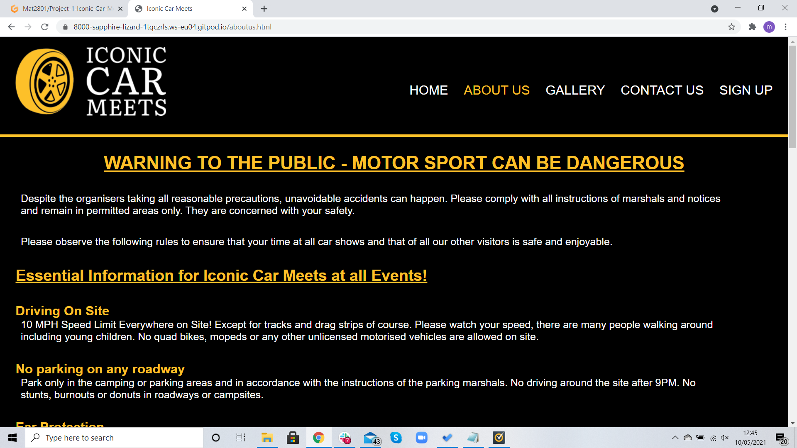

# Testing

## Starting off with validation of the code

[CSS Validator](https://jigsaw.w3.org/css-validator/)

[HTML Validator](https://validator.w3.org/)

- Home Page
 
Test passed 

- About Us Page

Test passed however, The warnings have been ignored as they are a design choice.

- Gallery Page

Test passed however, The warnings have been ignored as they are a design choice.

- Contact Us Page

Test passed however, The warnings have been ignored as they are a design choice.

- Sign Up Page

Test passed

---

## Browser Compatability

- Tested over 4 different browsers and worked correctly however, using firefox does error the video from loading. (show in bug notes)

---

## Responsivness

- I tested all devices using [ChromeDevTools](https://developer.chrome.com/docs/devtools/)

#### Desktop Tests

#### Tablet Tests

#### Mobile 

During testing the video on the Home page was centered for all devices however when reducing the screen width slowly the video moved around 
a little more than I would like, this has also been noted in the bugs section.

---

## Testing User Stories

- A frequent user, I would like to sign up to become a memeber.
    * When the user is navigating through the site there is a navigation option to head to the **sign up** page.
    * When the user see's the **Join the club** section, here it speaks about heading to the sign up page to become a member.

- A frequent user, I would like to contact you to be able to place my show car on a stand or a track.
    * When navigating the website the user can click the navigation link **Contact Us** and fill out a short form.
    * When navigating the the **contact Us** section the user will also find an address, email and phone number.

- A frequest user, What rules do I have to follow when going to events
    * Whilst navigating through the website the user will see an **About Us** page where the user will find all rules regarding the events.

- An owner, I want to show how easy event are to find and visit.
    * When the landing page loads up there is a link above the landing image with a link to the **Times & Location** section. 
    * Scrolling through the home page the user will see big pictures of some very rare iconic cars here they will see the **Times & Locations**.

- An owner, I want to make things easier for users to be able to show there cars on stands and tracks.
    * Using the **Contact us** page the user can fill in a quick easy form that will be emailed directly to the owner.
    * The user can find the business phone number on the **Contact us** section.
    * Users can find the business address via the **Contact us** section.

- An owner, I would like to gain memebers who can meet together at events.
    * Scrolling down the **Home page** users will see a **join the club** section.
    * Navigating through the site users can click the navigation button **Sign up**.

- An infrequent user, I would like to check out what locations and times meets this month will be at.
    * While navigating the site the user can scroll down and easily find the **Times & Navigation** section for all event times and dates.
    * The user can use the **contact us** navigation to ask any other questions which is stated on the **join the club** section.

- An infrequent user, I would like to contact them about a few extra questions i have. 
    * Scrolling down the **Home page** a user will see the **Join the club** section here it explains how to contact us.
    * Navigating through the website the user can navigate to **Contact us**

- An unsure user, is there any information related to the events.
    * Navigating through the website the user will navigate to the **About us** section where they will find all information. 
    * User can also navigate to the **Contact us** section for more information. 

- An unsure user, does this business have an address.
    * Navigating through the website the user can find the **Contact us** page where they will find the business address.

- A new user, I would love to check out some pictures of previous events.
    * Scrolling through the **Home page** the user can see some previous event pictures.
    * Whilst navigating the website the user can click **Gallery** navigation to see more previous event images.

- A new user, do they have any social media.
    * Scrolling through any of the pages on the website the user will find links to all **social media** these will open in a new tab.

---

## Current Bugs
- Video does not center when fully responsive I have tried to narrow this down and using media queries has helped. The video 
will be centered when using most devices and on the main desktop however, when testing for responsivness the video will not
always stay centered. I have attempted to fix this problem using position:absolute, but because my other sections are not position 
as relative this does not work. This only places the video central for the desktop size and when narrowing the width covers up the video 
rather than recentering it. 
- When loading the website up using FireFox browser the video does not load correctly. 

#### Bugs that have been fixed
- Time and location tiles images wouldn't center. Fixed by manually resizing images and putting images into CSS instead of HTML.
- Step back on a commit due to messing up css code unsure what the issue was.
- Trying to fade images for location and time using rbga background colour but not working. Fixed using an overlay.
- Times and location images not lining up correctly, one is a little lower than all the rest. Fixed using padding
- Creating a burger menu and keeping text in a list. Fixed using visability as hidden and visible depending on active.
- Video centering - Still having issues, tried using positioning such as absolute.

Head back to the [ReadMe file](README.md)